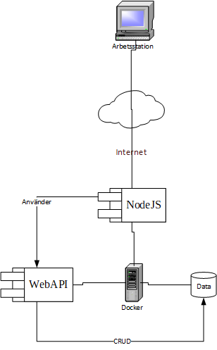

Kalori App is a website under development. The website is intended to help people keep track of calorie intake.
This part will be the backend of the app. The plan is to use NodeJS with the MongoDB database.
# Plan/Model of first iteration
## Form

## Response

## Model
