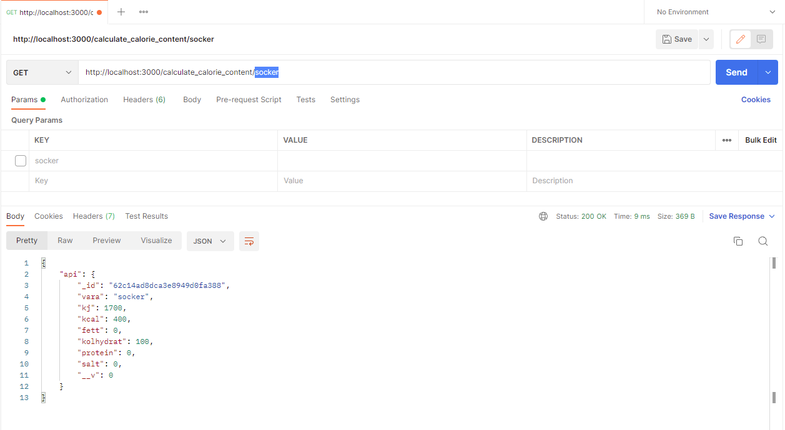
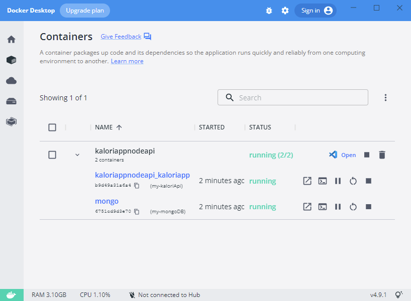

Kalori App is a website under development. The website is intended to help people keep track of calorie intake. This project will not be completed. The intention is just to work out on how to communicate with an API.

This is the API.

# How it work
The last segment of the URL is a parameter. This URL is searched for in the database and if there is a hit the database will return a json object
## Postman

# Run
<i>Clone repo and install docker then run:</i>  
docker-compose up -d

<i>Then go to the browser and enter:</i> http://localhost:3000/calculate_calorie_content/socker
## Docker desktop
